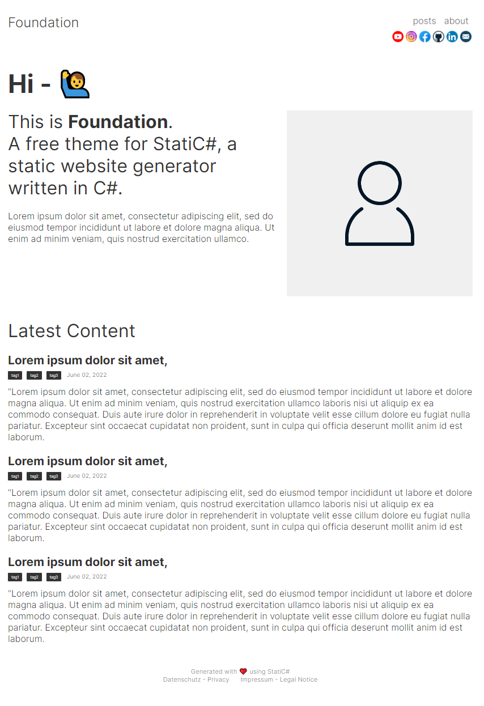
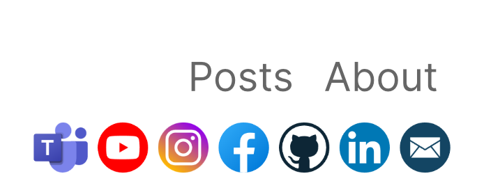
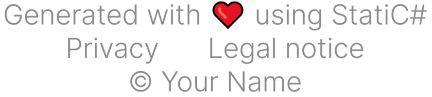

<p align="center">
    
</p>

<p align="center">
    <a href="https://docs.microsoft.com/en-us/dotnet/csharp/">
        
    </a>
    <a href="https://dotnet.microsoft.com">
        
    </a>
    <a href="https://github.com/RolandBraunDev/StatiCsharp">
        
    </a>
    
    
    <a href="https://www.nuget.org/packages/StatiCsharp.Theme.Foundation">
        
    </a>
</p>

A theme for [StatiC#](https://github.com/RolandBraunDev/StatiCsharp), a static website generator written in C#.

## Example

<p align="center">
    
</p>

## Installation

Add **Foundation** to your StatiC# project as a package reference in the .csproj file:

```
<ItemGroup>
    <PackageReference Include="StatiCsharp.Theme.Foundation" Version="0.1.0-alpha4" />
</ItemGroup>
``` 
Build your project to restore packages.  
You can then import Foundation at the top of your `Program.cs` and inject the theme to StatiC#'s website generating process by initializing a new FoundationHtmlFactory:

```C#
using StatiCsharp;
using Foundation;

var myAwesomeWebsite = new Website(
    url: "https://yourdomain.com",
    name: "My Awesome Website",
    description: @"Description of your website",
    language: "en-US",
    sections: "posts, about"
);

var theme = new FoundationHtmlFactory();
// Set up social icon here if needed.

var manager = new WebsiteManager(
    website: myAwesomeWebsite,
    htmlFactory: theme,                 // here Foundation is injected to the generating process
    source: @"/path/to/your/project"
);

manager.Make();
```

To set the portrait image on the index page, provide a `me.jpg` image in the root of your `Resources` directory.

## Advanced settings

You can configure Foundation after initializing FoundationHtmlFactory to show social icons on the top right corner of your website. Set the property to the target page of your social networks.

```C#
theme.Email = "mail@yourdomain.com";
theme.Facebook = "https://facebook.com/yourName";
```

Foundation currently supports social icons for E-Mail, LinkedIn, GitHub, Facebook, Instagram and YouTube.

 

To set legal notice and/or privacy links in the footer use:

```C#
theme.LegalNotice = "/your/logalNoticePage";
theme.Privacy = "/your/privacyPage";
```


