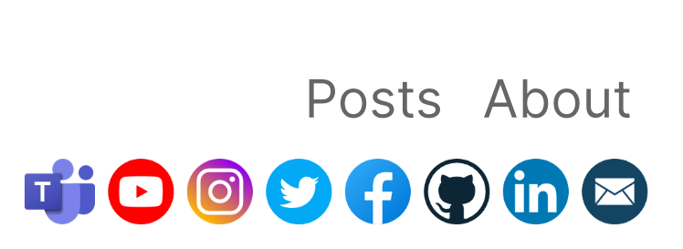

<p align="center">
    
</p>

<p align="center">
    <a href="https://docs.microsoft.com/en-us/dotnet/csharp/">
        
    </a>
    <a href="https://dotnet.microsoft.com">
        
    </a>
    <a href="https://github.com/rolandbraun-dev/StatiCsharp">
        
    </a>
    
    
</p>

A theme for [StatiC#](https://github.com/rolandbraun-dev/StatiCsharp), a static webside generator written in C#.

## Installation

Add **Foundation** to your StatiC# project as a package reference in the .csproj file:

```
<ItemGroup>
    <PackageReference Include="StatiCsharp.Theme.Foundation" Version="0.1.0-alpha2" />
</ItemGroup>
``` 
Build your project to restore packages.  
You can then import Foundation at the top of your `Program.cs` and inject the theme to StatiC#'s website generating process by initializing a new FoundationHtmlFactory:

```C#
using StatiCsharp;
using Foundation;

var myAwesomeWebsite = new Website(
    url: "https://yourdomain.com",
    name: "My Awesome Website",
    description: @"Description of your website",
    language: "en-US",
    sections: "posts, about",
    source: @"/path/to/your/project"
    );

var theme = new FoundationHtmlFactory();

// Set up social icon here if needed.

website.Make(theme);
```

## Advanced settings

You can configure Foundation after initializing FoundationHtmlFactory to show social icons on the top right corner of your website. Set the property to the target page of your social networks.

```C#
theme.Email = "mail@yourdomain.com";
theme.Facebook = "https://facebook.com/yourName";
```

Foundation currently supports social icons for E-Mail, LinkedIn, GitHub, Facebook and Instagram.

 

To set legal noctive and/or privacy links in the footer use:

```C#
theme.LegalNotice = "/your/logalNoticePage";
theme.Privacy = "/your/privacyPage";
```

